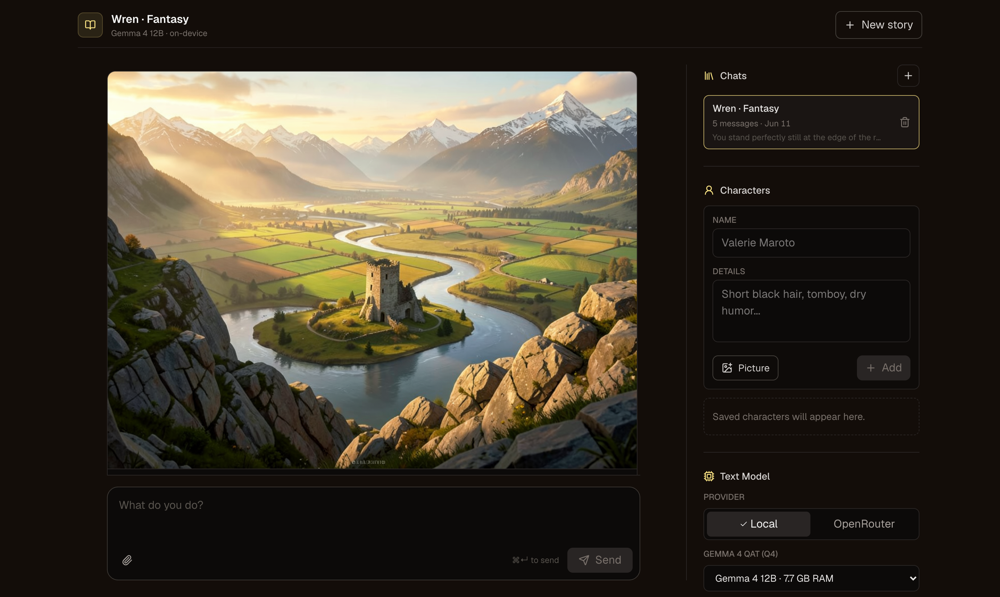
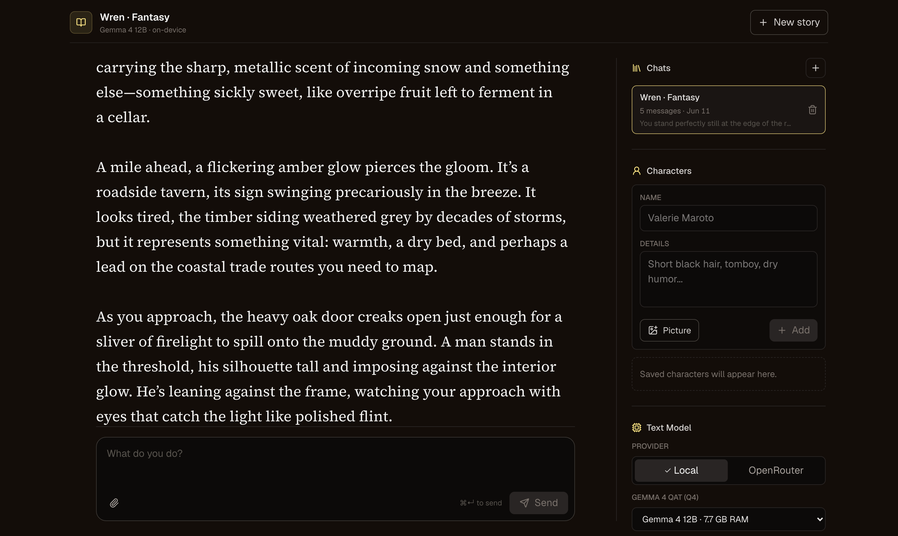
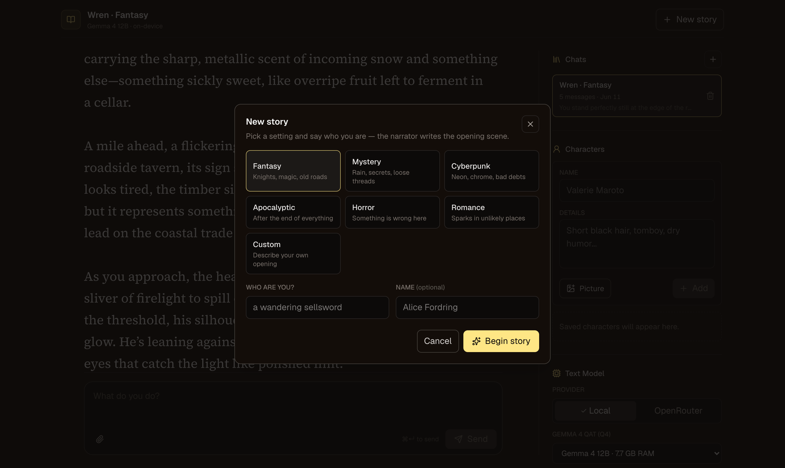

# Open Dungeon

The first **easy-to-use, fully local** AI roleplay app. The story and the
**inline scene images** are both generated on your own machine — no accounts,
no API keys, no cloud, no GPU rig. Your stories never leave your computer.



- **Local text generation** via [Ollama](https://ollama.com) (Gemma 4 QAT),
  or **Connect a server** to any OpenAI-compatible backend — llama.cpp,
  LM Studio, vLLM, a remote Ollama, OpenRouter. Narration **streams in real
  time** as the model writes.
- **Local image generation** — the narrator calls a `generate_image` tool and
  scenes render inline: FLUX.2-klein on Apple Silicon / NVIDIA / supported
  AMD Radeons, or point the app at your own **ComfyUI** instance.
- **Full play controls** — Do / Say / Story input, Continue, Retry, Erase,
  and inline Edit on any passage. Quick-start presets write a custom opening.
- **Long-story memory** — history fills the model's context window
  (128K–256K), and older passages compact into a rolling "story so far"
  summary instead of being forgotten.
- **Characters with visual continuity** — saved portraits feed both the
  narrator (vision context) and the image generator (reference images).
- **Private by design** — everything lives in a local SQLite database and
  folders on your disk. Play from your phone over Tailscale.

<table>
  <tr>
    <td></td>
    <td></td>
  </tr>
</table>

## Quick start

**Mac (Apple Silicon):** grab the DMG from
[Releases](https://github.com/newideas99/open-dungeon/releases), drag
**Open Dungeon** to Applications, and open it (right-click → Open the first
time — it's unsigned). It walks you through everything, including choosing
Ollama or your own server as the narrator.

**Windows:** download the release zip (or clone), then double-click
`Launch-Windows.bat`. It checks Node.js, builds the app, and starts
http://localhost:3000. Ollama and image generation are optional prompts —
see the [Windows guide](docs/windows.md).

**From a clone (any OS):**

```bash
git clone https://github.com/newideas99/open-dungeon && cd open-dungeon
npm install

# optional, only if you want the bundled Ollama provider
ollama pull gemma4:12b-it-qat

npm run dev
```

Open http://localhost:3000 and start writing. Node.js 22+ required; text
play needs no other setup.

## Playing

The composer has three input modes — **Do** (a player action), **Say**
(dialogue), and **Story** (write narration yourself) — plus **Continue**,
**Retry**, and **Erase** above it. Hover any message and hit **Edit** to
rewrite it in place. Everything saves to the local database as you go.

## Guides

| Guide | Covers |
|---|---|
| [Text backends](docs/text-backends.md) | Gemma 4 model choices and benchmarks, Connect a server, long-story memory |
| [Image generation](docs/image-generation.md) | FLUX worker setup, ComfyUI backend, AMD GPUs, the story image tool |
| [Windows](docs/windows.md) | Launcher details, image smoke tests, diagnostics, tuning |
| [Configuration](docs/configuration.md) | Environment variables, playing from your phone, local data |

## Content note

This app is built for private, local fiction. The default narrator prompt
permits consensual adult content between adults; everything is generated and
stored only on your machine. Edit the system prompt in
`src/lib/story-prompt.ts` if you want different defaults.

## Support the project

Open Dungeon is free and MIT-licensed, and it always will be. If it earns a
spot on your machine and you want to help with development, a tip goes a
long way:

- **[Sponsor on GitHub](https://github.com/sponsors/newideas99)**
- **[Buy me a coffee on Ko-fi](https://ko-fi.com/opendungeon)**

Starring the repo and sharing it helps too.

## License

MIT
