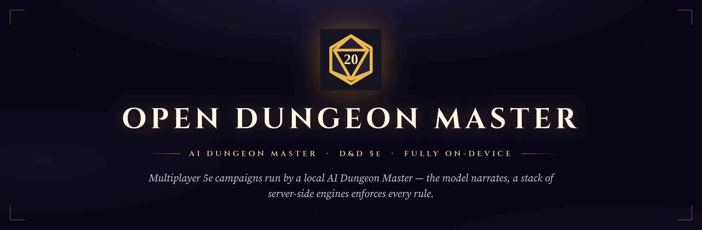
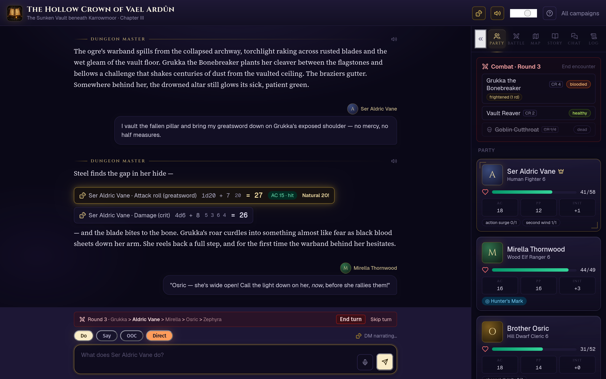

<div align="center">



<br>

[](LICENSE)
[](package.json)
[](docs/rules-coverage.md)
[](#requirements)
[](#)

</div>

**Open Dungeon Master** runs multiplayer (and solo) Dungeons &amp; Dragons 5e
campaigns with an AI Dungeon Master, fully on your own machine. A local model is
the creative mind and narrator; a stack of server-side engines enforces the 5e
rules for both the players and the DM. **The narrator never owns the numbers** —
dice, hit points, spell slots, conditions, and the death track are computed and
clamped by the backend, and the model changes game state only through tools the
server validates.

It began as a fork of [Open Dungeon](https://github.com/newideas99/open-dungeon)
to add multiplayer, and grew into a different app: the AI drives the session,
requesting rolls, starting encounters, and playing NPCs and companions, following
a secret story arc it regenerates as the campaign moves.

<div align="center">

### The table, mid-combat



<sub><i>A live session of <b>The Hollow Crown of Vael Ardûn</b> — DM narration and server-rolled dice on the left, the encounter tracker and the whole party's HP, conditions and resources on the right.</i></sub>

</div>

## What's in the box

<table>
<tr>
<td width="50%" valign="top" align="center">
<br>
<b>The multiplayer table</b><br>
<sub>Create a campaign, share an invite code, ready up in the lobby, and play in real time (SSE live updates) with a party lead who steers settings, rolls and turn order. Solo play runs the same engines.</sub>
</td>
<td width="50%" valign="top" align="center">
<br>
<b>Local AI Dungeon Master</b><br>
<sub>Any OpenAI-compatible server with tool calling — llama.cpp, Ollama, LM Studio, vLLM. The model narrates and makes creative calls; it never states a roll or edits its own numbers.</sub>
</td>
</tr>
<tr>
<td width="50%" valign="top" align="center">
<br>
<b>Server-enforced 5e rules</b><br>
<sub>Initiative and action economy, server-resolved attacks and crits, spell slots and upcasting, the full condition table, short/long rests, AC and progression — all clamped and audit-logged.</sub>
</td>
<td width="50%" valign="top" align="center">
<br>
<b>Secret story arc &amp; maps</b><br>
<sub>A hidden spine (premise, stakes, antagonist, ordered beats) regenerated as chapters close, a live quest log, rolling-summary memory, and procedural fog-of-war battle maps.</sub>
</td>
</tr>
<tr>
<td width="50%" valign="top" align="center">
<br>
<b>Characters &amp; companions</b><br>
<sub>Structured SRD 5.1 sheets, 48 classes and 49 backgrounds, a guided creation wizard and level-up flow, and full AI companions with real sheets that auto-level with the party.</sub>
</td>
<td width="50%" valign="top" align="center">
<br>
<b>Battle maps &amp; scene art</b><br>
<sub>Optional ComfyUI drives character portraits, inline scene art and top-down battle maps with per-character line of sight. Missing? It fails soft to a placeholder.</sub>
</td>
</tr>
<tr>
<td width="50%" valign="top" align="center">
<br>
<b>On-device &amp; encrypted</b><br>
<sub>All state lives in a local SQLite database, encrypted at rest. No accounts in the cloud, no telemetry — username/password auth (optional Discord), with an admin panel and undoable audit log.</sub>
</td>
<td width="50%" valign="top" align="center">
<br>
<b>Session tools</b><br>
<sub>Private DM-to-player whispers, player-to-player side chats the DM never sees, a 3D dice tray, DM voice narration (TTS), push-to-talk, and an installable PWA layout.</sub>
</td>
</tr>
</table>

## How it works

- **The engines own the rules.** The model narrates and makes creative calls, but
  it can only touch game state through server tools that are clamped, audit-logged,
  and published live to every player. It treats player messages as intent, not
  outcome.
- **The AI drives the table.** It asks the server for rolls (`request_roll`), starts
  and runs combat, plays NPCs and AI companions, moves the party, and decides when
  to spotlight specific players for input.
- **It follows a secret story arc.** Every campaign gets a hidden spine generated at
  start and refreshed with a small clamped delta each time a chapter closes, so the
  plot advances without the model rewriting history. Player-safe pieces surface as
  the quest log; DM-only hooks stay hidden.

The authoritative ledger of exactly what is enforced, what is guidance, and what is
out of scope is [docs/rules-coverage.md](docs/rules-coverage.md).

## Requirements

- **Node 22+** (npm). `npm install` pulls everything the app itself needs.
- **A text model backend** (one of):
  - [llama.cpp](https://github.com/ggml-org/llama.cpp) `llama-server` at
    `http://127.0.0.1:8001` serving a model named `qwen3.6-35b`. This is the default
    and preferred configuration (see below). Or:
  - any other OpenAI-compatible server with tool calling: Ollama, LM Studio, vLLM,
    TabbyAPI, KoboldCpp, or a remote API like OpenRouter.
- **Optional services** (each feature simply stays off, or falls back to a
  placeholder, without it):
  - [ComfyUI](https://github.com/comfyanonymous/ComfyUI) at `:8188` for character
    portraits, inline scene art, and battle maps
    ([docs/image-generation.md](docs/image-generation.md))
  - [Kokoro-FastAPI](https://github.com/remsky/Kokoro-FastAPI) at `:8880` for DM
    voice narration
  - a faster-whisper server at `:8870` for push-to-talk
    ([docs/configuration.md](docs/configuration.md))

## Quick start

```bash
git clone <this repo> && cd open-dungeon-master
npm install

# The database is encrypted at rest; generate a key once and keep it safe.
echo "DB_ENCRYPTION_KEY=$(openssl rand -hex 32)" > .env.server

# Build the content pack: spells, feats, items, subclasses, monsters.
# Downloads from api.open5e.com once, then caches for offline re-runs.
node scripts/import-open5e.mjs

npm run dev        # http://localhost:3000, or:
npm run dev:lan    # 0.0.0.0:3005 so your party can reach it on the LAN
```

Then start the DM model with llama.cpp's `llama-server`. See
[The default DM model](#the-default-dm-model-qwen36-35b-on-llamacpp) below for the
exact command and settings.

**The first account registered becomes the server admin.** To promote someone on an
existing install: `node scripts/make-admin.mjs <username>`.

### Content pack

`node scripts/import-open5e.mjs` builds `data/content/open5e.sqlite`, the read-only
pack holding every spell, feat, item, subclass, lineage and monster the character
builder and the DM can reach. Raw API pages are cached under `data/content/raw/`, so
later runs need no network; `--refresh` re-downloads them, and `CONTENT_DB_PATH`
points the app at a pack somewhere else.

Run it before your first session. The app still boots without the pack, but it falls
back to the much smaller bundled SRD 5.1 data in `src/lib/srd/` and shows a hint to
run the import, so players will find most content missing. The pack is not committed:
it is third-party open-licensed content (OGL, ORC and CC-BY documents) rebuildable
from the script in one command. See [docs/content.md](docs/content.md) and
[docs/LICENSES.md](docs/LICENSES.md).

For real sessions build and run the production server:

```bash
npm run build
npm run start:lan   # 0.0.0.0:3005
```

## The default DM model (qwen3.6-35b on llama.cpp)

The app defaults to llama.cpp's `llama-server` at `http://127.0.0.1:8001/v1` serving
Qwen3.6-35B-A3B (a MoE model, q8) under the model name `qwen3.6-35b`, with a **64K
context window** and Qwen's recommended samplers. A small default context silently
truncates the DM prompt (party sheets, scene, story summary), which makes the model
loop; the 64K window is what makes the difference. Run it:

```bash
llama-server -m Qwen3.6-35B-A3B-Q8_0.gguf \
  -c 65536 --jinja \
  --flash-attn on --cache-type-k q8_0 --cache-type-v q8_0 \
  --temp 0.7 --top-p 0.95 --top-k 20 --min-p 0.0 \
  --port 8001 --alias qwen3.6-35b
```

`--jinja` enables tool calling, which the dice engine and every sheet mutation depend
on. In llama-server's router mode the same settings live in the model's preset INI
instead of flags. If your server runs with `--api-key`, put the key in `.env.server`
as `OPENAI_COMPAT_API_KEY`.

### Tool calls need thinking mode

This is the setting that matters most for a working table, and it is not obvious.
Under the long DM prompt, qwen3.6-35b in non-thinking mode surfaces tool calls only
about one turn in five: it narrates fights instead of starting an encounter, asks a
player to roll in prose instead of calling `request_roll`, and generally stops
driving the engines. With reasoning enabled it calls tools reliably.

The app handles this per request, so you do not configure it on the server:

- It sends `chat_template_kwargs: { enable_thinking: true }` on the **tool-decision**
  model calls only, and keeps the **final narration** call non-thinking so it still
  streams to players smoothly.
- Set `DM_THINKING=0` to force thinking off everywhere. That makes turns fast but tool
  calls unreliable; it is a fallback, not a normal mode.

### Reasoning budget and latency

Left uncapped, a reasoning-enabled decision call can occasionally spiral for minutes
on a hard turn. Cap the reasoning budget on the server to roughly 1024-2048 tokens
(llama-server's `--reasoning-budget`, or the equivalent key in the preset INI).
Expect the tradeoff: tool-decision calls run about 50-100s and a full turn about
1.5-3 minutes on a single local GPU. Combat and multi-tool turns sit at the longer
end.

### presence_penalty

Keep `presence_penalty` at 0 for the DM. A meaningful presence penalty under the long
prompt suppresses tool calls (the model paraphrases the tool in prose instead of
emitting it). The app pins `presence_penalty: 0` in every request so a server-side
preset penalty cannot break tool calling; if you drive the model from somewhere else,
set it to 0 there too.

### The same model on other LLM software

The setup is pure settings, so it ports to any OpenAI-compatible server with tool
calling. The key settings to replicate anywhere: **context 65536, temperature 0.7,
top-p 0.95, top-k 20, min-p 0, presence_penalty 0**, plus a way to enable reasoning
for tool calls. Then point the app at your server (admin panel, campaign Text Model
settings, or `OPENAI_COMPAT_BASE_URL`). For Ollama, the committed
[Modelfile](models/qwen3.6-dm.Modelfile) bakes the same settings in:

```bash
ollama pull qwen3.6:35b-a3b-q8_0
ollama create qwen3.6-dm -f models/qwen3.6-dm.Modelfile
# then point the app at http://127.0.0.1:11434/v1, model qwen3.6-dm
```

More backends and model guidance: [docs/text-backends.md](docs/text-backends.md).

## Image generation (ComfyUI)

ComfyUI at `COMFYUI_URL` (default `http://127.0.0.1:8188`) drives three things:
character portraits generated once at character creation, inline scene art during
play, and the top-down battle maps. Any checkpoint works; the genre preset supplies
the art style. If ComfyUI is down or busy, these features fail soft to a placeholder
or a plain icon and the session keeps going.

All GPU-heavy media (ComfyUI images and TTS) run on a **single serial media queue**.
On a shared-memory iGPU the image model and the DM model compete for the same pool,
so jobs are serialized to avoid out-of-memory stalls rather than run in parallel.
Details in [docs/image-generation.md](docs/image-generation.md).

## Voice (TTS and push-to-talk)

- **DM narration**: [Kokoro-FastAPI](https://github.com/remsky/Kokoro-FastAPI) at
  `KOKORO_URL` (default `http://127.0.0.1:8880`) renders each DM message to speech on
  the media queue, with a per-campaign voice and per-user mute / volume / replay.
- **Push-to-talk**: a faster-whisper server at `STT_URL` (default
  `http://127.0.0.1:8870`, model `STT_MODEL`) transcribes your voice with a
  confirm-then-send step.

## Configuration and settings precedence

Most things are configurable in the app itself. When the same setting exists in
several places, the order is:

1. **Campaign settings** (in-game Text Model / image panels), which always win
2. **Admin panel** (`/admin`, stored in the database)
3. **Environment variables** (`.env.server`, see
   [docs/configuration.md](docs/configuration.md))
4. Built-in defaults

Secrets (API keys, `DB_ENCRYPTION_KEY`, Discord credentials) belong in `.env.server`
or the admin panel, never in code or `.env.local`.

## Admin panel

Log in as an admin and open `/admin` (linked from the account menu):

- **Server settings**: default text model backend / URL / API key, ComfyUI and
  image-worker URLs and checkpoint, TTS / STT URLs, Discord sign-in credentials, and
  the sign-up toggle (close registration once your party is in).
- **Users**: list everyone, promote / demote admins, delete accounts, and reset
  passwords; a temporary password is shown once, and the user must set a new one at
  their next login.

## Discord sign-in (optional)

1. Create an application at <https://discord.com/developers/applications>.
2. Under OAuth2, add the redirect URI `<public-url>/api/auth/discord/callback` using
   the exact URL players reach the app on: `http://<lan-host>:3005/...` on a LAN, or
   `https://your.domain/...` behind a reverse proxy.
3. Put the Client ID and Client Secret in the admin panel (or `DISCORD_CLIENT_ID` /
   `DISCORD_CLIENT_SECRET` in `.env.server`).
4. Behind a reverse proxy: set the **Public URL** in the admin panel's Server section
   (or `APP_PUBLIC_URL` in `.env.server`) to the address players use, e.g.
   `https://your.domain`.

The "Sign in with Discord" button appears automatically once both are set. Existing
users can link Discord to their account from Settings.

## Storage and the single-writer rule

All state lives in a local SQLite database at `data/local-roleplay.sqlite` (override
with `SQLITE_DB_PATH`), encrypted at rest with the `DB_ENCRYPTION_KEY` from
`.env.server`; losing the key means losing the data. The read-only Open5e content
pack (`data/content/open5e.sqlite`) stays unencrypted. The database driver is
synchronous and the app assumes **one Next.js process owns the database file**. Do
not run `npm run dev` and a production service against the same `data/` directory;
point dev at a scratch database with `SQLITE_DB_PATH`.

## Credits and licenses

- Forked from [Open Dungeon](https://github.com/newideas99/open-dungeon) by Jacob
  Ferrari, MIT licensed. See [LICENSE](LICENSE).
- Game rules data derives from the System Reference Document 5.1 by Wizards of the
  Coast LLC, licensed under CC-BY-4.0. See [docs/LICENSES.md](docs/LICENSES.md).
- Expanded options (the widely played subclasses, spells, feats and lineages that no
  open dataset carries) are original content: the mechanics are stated in our own
  wording, and no publisher's descriptive text is reproduced.

<sub>Dungeons &amp; Dragons and D&amp;D are trademarks of Wizards of the Coast LLC. This
project is not affiliated with, endorsed, or sponsored by Wizards of the Coast.</sub>
